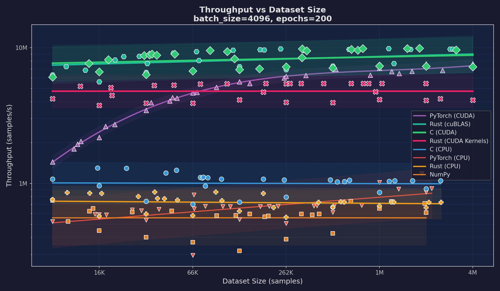
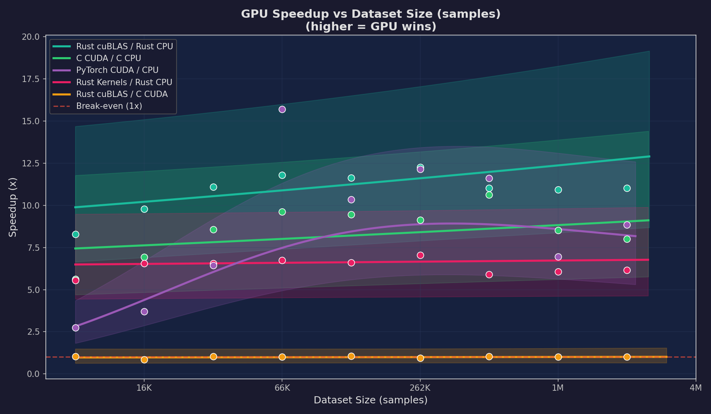
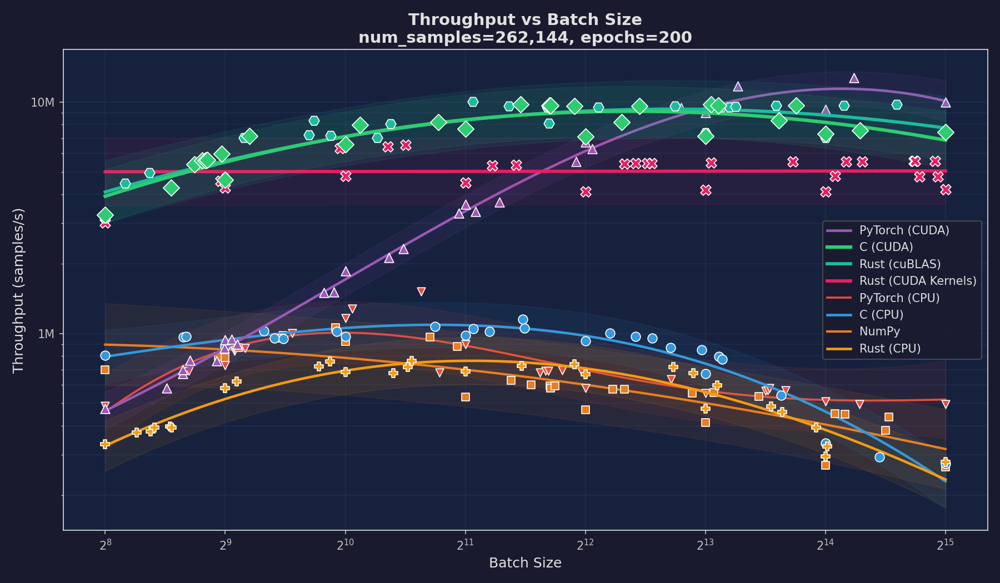
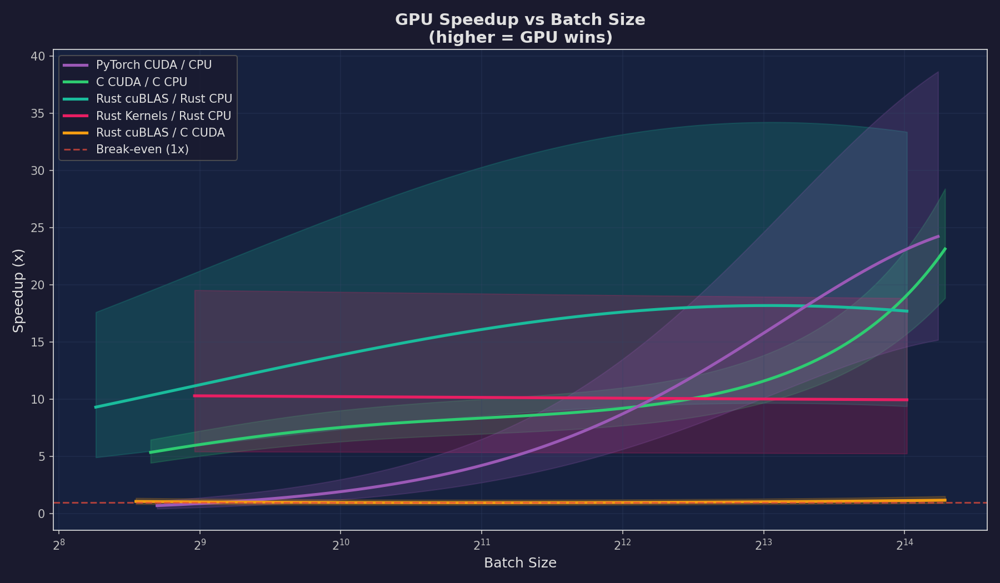
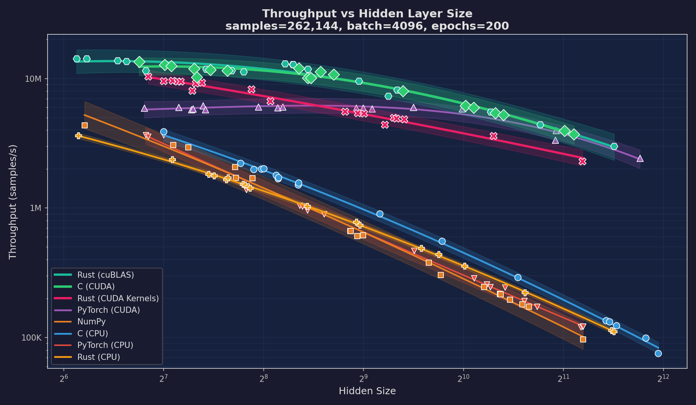
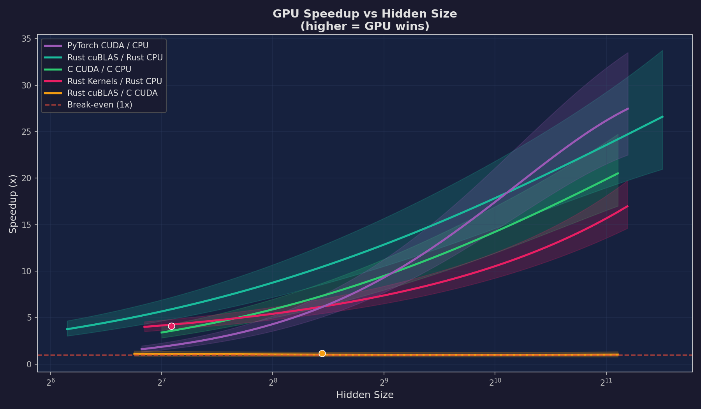
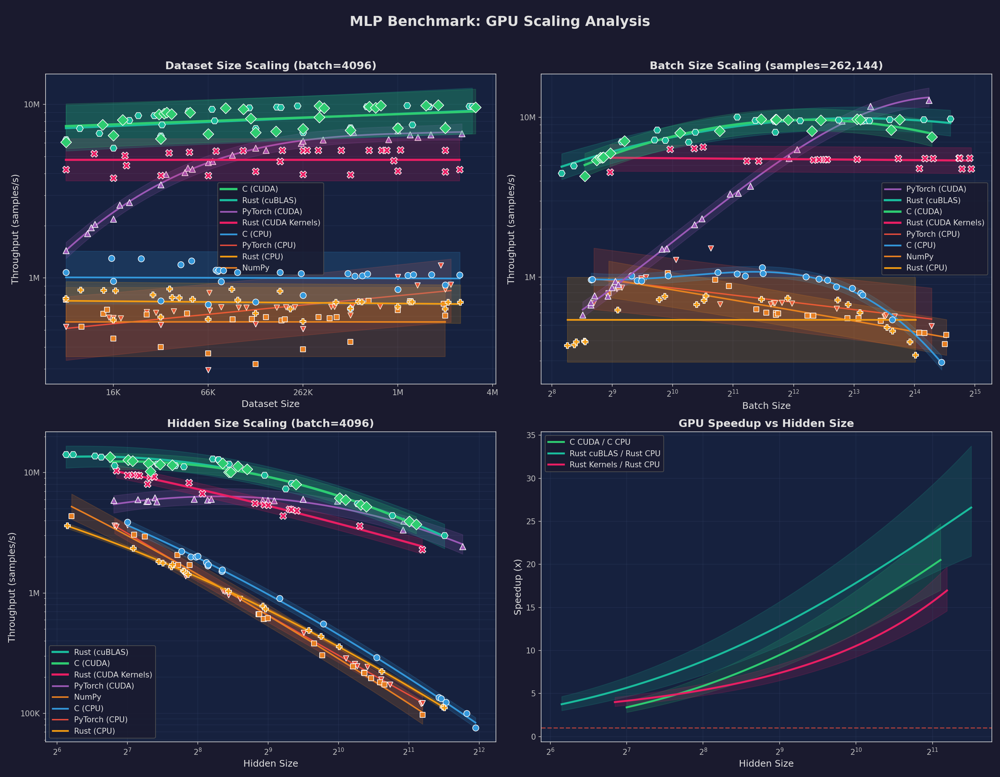
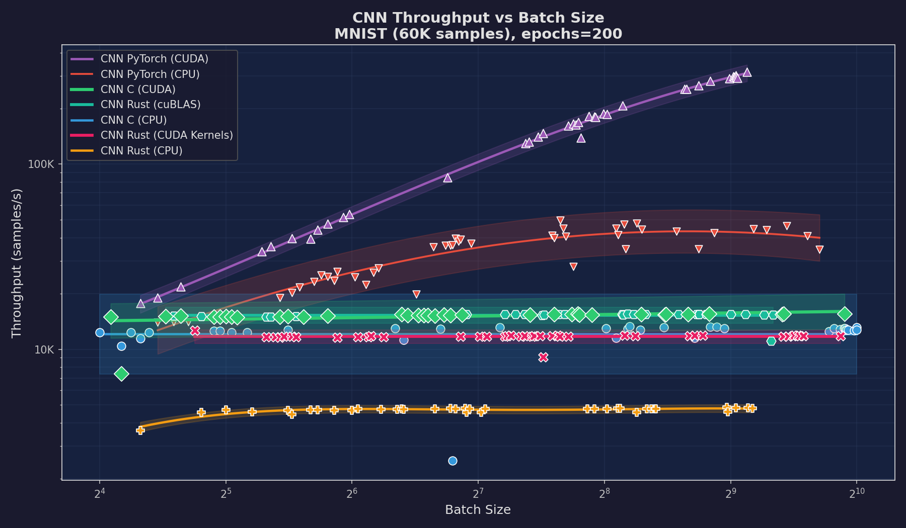
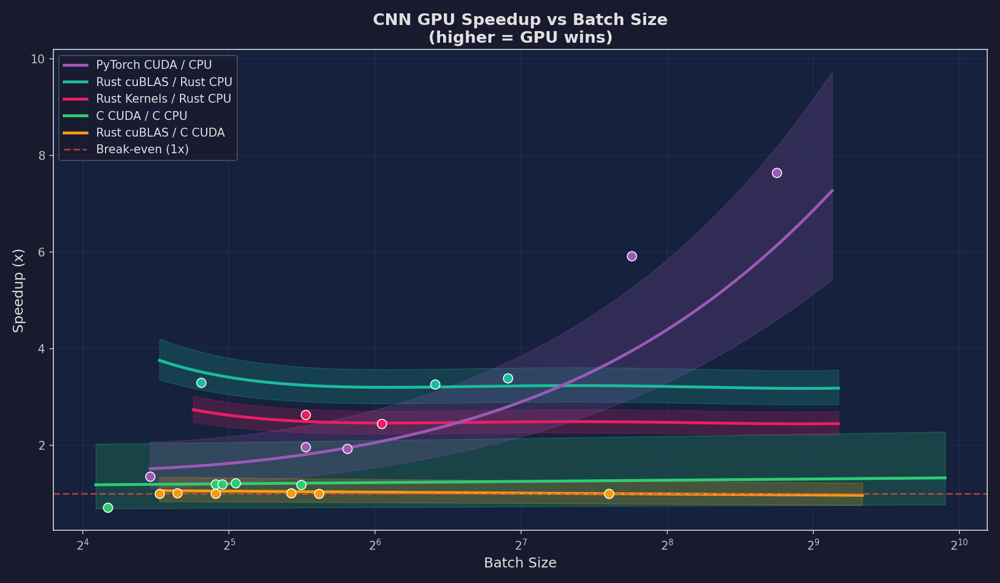
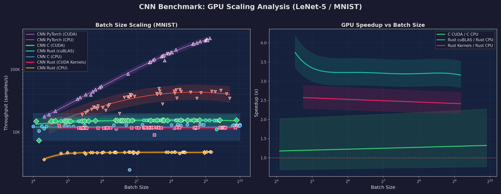

# ML Language Playground: Multi-Language Neural Network Benchmark

A multi-language machine learning benchmark comparing neural network implementations across C, Rust, and Python. Two model families --- MLP (8 implementations) and CNN/LeNet-5 (7 implementations) --- span CPU and GPU backends to measure throughput scaling.

## MLP Architecture

| Component | Choice | Rationale |
|-----------|--------|-----------|
| Hidden layers | 1 (configurable size, default 64) | Simple enough to implement from scratch, sufficient for tabular data |
| Hidden activation | ReLU | Fast, avoids vanishing gradients |
| Output activation | Softmax | Produces class probabilities for multi-class classification |
| Loss | Cross-entropy | Standard for classification; clean gradient with softmax |
| Initialization | Xavier uniform (sqrt(2/fan_in)) | Keeps activation variance stable across layers |
| Optimizer | Mini-batch SGD (configurable lr/batch) | Simple, no dependencies, easy to implement identically across languages |

## Implementations

| Implementation | File | Description |
|---------------|------|-------------|
| C (CPU) | `src/c/models/mlp/mlp_cpu.c` | Manual backprop in C99 with OpenMP parallelization and cache-tiled GEMM |
| C (CUDA) | `src/c/models/mlp/mlp.cu` | GPU kernels, one CUDA thread per sample, atomicAdd for gradients |
| Rust (CPU) | `src/rust/mlp-cpu/src/main.rs` | Rayon threadpool (physical cores) + cache-tiled GEMM (TILE=64) |
| Rust (cuBLAS) | `src/rust/mlp-cuda-cublas/src/main.rs` | cuBLAS FFI for GEMM + custom CUDA kernels for elementwise ops |
| Rust (CUDA Kernels) | `src/rust/mlp-cuda-kernels/src/main.rs` | All custom CUDA kernels including shared-memory tiled matmul |
| NumPy (CPU) | `src/python/models/mlp/mlp_numpy.py` | Vectorized NumPy, exact replica of C algorithm |
| PyTorch (CPU) | `src/python/models/mlp/mlp_pytorch.py` | nn.Module with manual Xavier init to match C, CPU backend |
| PyTorch (CUDA) | `src/python/models/mlp/mlp_pytorch.py` | Same PyTorch model on GPU via `--device cuda` |

All 8 MLP implementations produce identical standardized output for benchmark parsing, including throughput in samples/s.

## CNN Architecture (LeNet-5)

| Component | Choice | Rationale |
|-----------|--------|-----------|
| Conv1 | 1->6 channels, 5x5 kernel | Classic LeNet-5 first layer for edge/texture detection |
| Conv2 | 6->16 channels, 5x5 kernel | Learns higher-level feature combinations |
| Pooling | 2x2 average pooling (stride 2) | Spatial downsampling, matches original LeNet-5 |
| Convolution method | im2col + GEMM | Converts convolution to matrix multiply, reuses optimized tiled GEMM |
| FC layers | 256->120->84->10 | Standard LeNet-5 classifier (16x4x4 = 256 after two pool layers) |
| Activations | ReLU (all layers) | Modern replacement for LeNet-5's original sigmoid/tanh |
| Output | Softmax + Cross-entropy | Same as MLP for consistent loss computation |
| Initialization | Xavier uniform | Same sqrt(2/fan_in) scale as MLP, adapted for conv fan_in = C_in x kH x kW |
| Optimizer | Mini-batch SGD (lr=0.01) | Identical to MLP for fair comparison |

### CNN Implementations

| Implementation | File | Description |
|---------------|------|-------------|
| C (CPU) | `src/c/models/cnn/cnn_cpu.c` | im2col + OpenMP-parallelized tiled GEMM, shared nn_ops library |
| C (CUDA) | `src/c/models/cnn/cnn.cu` | GPU im2col + cuBLAS GEMM, custom elementwise CUDA kernels |
| Rust (CPU) | `src/rust/cnn-cpu/src/main.rs` | im2col + Rayon threadpool with cache-tiled GEMM (TILE=64) |
| Rust (cuBLAS) | `src/rust/cnn-cuda-cublas/src/main.rs` | cuBLAS GEMM + custom CUDA kernels for conv/pool/activations |
| Rust (CUDA Kernels) | `src/rust/cnn-cuda-kernels/src/main.rs` | All custom CUDA kernels including shared-memory tiled matmul |
| PyTorch (CPU) | `src/python/models/cnn/cnn_pytorch.py` | nn.Module with manual Xavier init, CPU backend |
| PyTorch (CUDA) | `src/python/models/cnn/cnn_pytorch.py` | Same model on GPU via `--device cuda` |

NumPy is excluded from CNN benchmarks: pure-Python im2col is prohibitively slow (timeouts at 600s), unlike MLP where NumPy's BLAS backend makes it a competitive CPU baseline.

All CNN implementations train on MNIST (60K training / 10K test, 28x28 grayscale digits, 10 classes).

## Datasets

| Name | Samples | Features | Classes | Source |
|------|---------|----------|---------|--------|
| `generated` | Configurable (default 1000) | 2 | 2 | Synthetic 2D circle classification |
| `iris` | 150 | 4 | 3 | UCI Iris |
| `wine-red` | 1599 | 11 | 11 | UCI Wine Quality (red) |
| `wine-white` | 4898 | 11 | 11 | UCI Wine Quality (white) |
| `breast-cancer` | 569 | 30 | 2 | Wisconsin Diagnostic Breast Cancer |
| `mnist` | 70,000 | 784 (28x28) | 10 | Handwritten digits (CNN only) |

## Quick Start

### Prerequisites

- **C**: GCC (C99), CMake 3.10+, OpenMP
- **CUDA**: NVIDIA CUDA Toolkit (for GPU implementations in C and Rust)
- **Rust**: Cargo (2021 edition)
- **Python**: Python 3.8+, NumPy, matplotlib, PyTorch

### Build Everything

The build script detects available toolchains and builds all possible targets:

```bash
./build.sh
```

This downloads datasets, installs Python dependencies, and builds all C, Rust, and CUDA targets. Targets whose toolchains are missing are skipped with a warning.

### Run Individual Implementations

All implementations accept `--batch-size`, `--num-samples`, `--hidden-size`, and `--epochs` flags for configurable hyperparameters.

```bash
# C (CPU)
./src/c/build_cpu/main --dataset iris

# C (CUDA)
./src/c/build_cuda/main --dataset iris

# Rust (CPU)
./src/rust/target/release/mlp-cpu --dataset iris

# Rust (cuBLAS)
./src/rust/target/release/mlp-cuda-cublas --dataset iris

# Rust (CUDA Kernels)
./src/rust/target/release/mlp-cuda-kernels --dataset iris

# NumPy
python3 src/python/models/mlp/mlp_numpy.py --dataset iris

# PyTorch (CPU)
python3 src/python/models/mlp/mlp_pytorch.py --dataset iris --device cpu

# PyTorch (CUDA)
python3 src/python/models/mlp/mlp_pytorch.py --dataset iris --device cuda

# --- CNN (LeNet-5 on MNIST) ---
# C (CPU)
./src/c/build_cpu/cnn_main --dataset mnist

# Rust (CPU)
./src/rust/target/release/cnn-cpu --dataset mnist

# PyTorch (CUDA)
python3 src/python/models/cnn/cnn_pytorch.py --dataset mnist --device cuda
```

### Run Benchmarks

```bash
# MLP: standard mode — accuracy + train time on real datasets
python3 src/scripts/benchmark.py --mode standard --datasets generated,iris,breast-cancer --runs 3

# MLP: scaling mode — throughput vs dataset size, batch size, and hidden size
python3 src/scripts/benchmark.py --mode scaling --runs 1

# MLP: budget mode — accumulate benchmark samples with variance-weighted scheduling
# Runs can be repeated; results accumulate in results/cache/benchmark_cache.json
python3 src/scripts/benchmark.py --mode scaling --budget 60   # 60 minutes

# Replot from cached data without running any benchmarks
python3 src/scripts/benchmark.py --mode scaling --budget 0

# CNN: scaling mode — throughput vs batch size on MNIST
python3 src/scripts/benchmark.py --mode scaling --model cnn --runs 1

# CNN: budget mode — accumulate samples (results merge with cache)
python3 src/scripts/benchmark.py --mode scaling --model cnn --budget 30 --scaling-epochs 20

# Replot CNN from cache
python3 src/scripts/benchmark.py --mode scaling --model cnn --budget 0
```

## MLP Scaling Benchmark Analysis

All measurements were collected on an NVIDIA RTX 3070 (46 SMs, 5888 CUDA cores, 8 GB GDDR6) paired with an Intel Core i9-10900F (10 cores, 20 threads, 2.80 GHz). The benchmark sweeps three independent axes --- dataset size, mini-batch size, and hidden-layer width --- while holding the other two fixed. Each configuration trains the full MLP for 200 epochs and reports end-to-end throughput in samples per second.

Throughput curves are fitted using Gaussian Process regression in log-log space, with 95% confidence bands derived from the GP posterior. Data points are sampled from continuous log-uniform distributions (not a fixed grid) using a gap-filling strategy that ensures even coverage. Results accumulate across runs via `--budget`, and the variance-weighted scheduler prioritizes under-sampled regions. Run `python3 src/scripts/benchmark.py --mode scaling --budget 60` to extend the dataset, or `--budget 0` to replot from cache.

### Peak Throughput Summary

| Experiment | C (CUDA) | Rust (cuBLAS) | PyTorch (CUDA) | Rust (Kernels) | C (CPU) | PyTorch (CPU) | NumPy | Rust (CPU) |
|---|---|---|---|---|---|---|---|---|
| Dataset Size | **9.90M** | 9.89M | 6.94M | 5.46M | 1.30M | 1.18M | 749K | 865K |
| Batch Size | 9.77M | 10.08M | **12.76M** | 6.52M | 1.15M | 1.52M | 1.06M | 762K |
| Hidden Size | 13.48M | **14.22M** | 6.19M | 10.41M | 3.89M | 3.66M | 4.34M | 3.61M |

---

### Dataset Size Scaling (8K -- 4M samples)

Fixed parameters: batch\_size = 4096, hidden\_size = 512, epochs = 200.



The dataset-size sweep shows that throughput is largely independent of dataset size for both CPU and GPU implementations. Both tiers maintain roughly constant throughput across two orders of magnitude (8K to 4M samples). The GPU implementations --- C CUDA, Rust cuBLAS, PyTorch CUDA, and Rust CUDA Kernels --- sustain approximately 5--10M samples/s throughout, with C CUDA and Rust cuBLAS at the top (~10M) and PyTorch CUDA consistently lower (~7M), the gap attributable to Python dispatch overhead and autograd bookkeeping. The CPU implementations cluster between 700K and 1.3M samples/s, also largely flat across the sweep.

This flat scaling is expected: with a fixed batch size of 4096, each mini-batch GEMM has the same dimensions regardless of how many total samples exist. More data simply means more mini-batches per epoch, and throughput (samples per second) stays constant because the per-batch cost is unchanged.



The GPU speedup plot shows a roughly constant ratio across dataset sizes --- typically 5--15x depending on the pair --- confirming that the GPU advantage comes from faster per-batch computation, not from better scaling behavior. The confidence bands are wider at the extremes of the range where fewer data points constrain the GP fit. The Rust cuBLAS / C CUDA ratio (orange line) hovers near 1.0x throughout, confirming that the Rust FFI bindings to cuBLAS introduce negligible overhead compared to calling CUDA APIs directly from C.

---

### Batch Size Scaling (256 -- 32K)

Fixed parameters: num\_samples = 262,144, hidden\_size = 512, epochs = 200.



Batch size is the primary lever for GPU utilization because it determines how many threads can execute in parallel during a single GEMM call. The RTX 3070 has 46 streaming multiprocessors, each capable of scheduling up to 2048 threads, for a total of approximately 94K concurrent threads at full occupancy. A batch size of 256 produces GEMM dimensions of (256 x 512) and (512 x 512) --- enough work to partially fill the GPU, but not enough to fully hide memory latency through thread-level parallelism.

The GPU throughput curves rise steeply from batch size 256 through 4096, with each doubling of batch size yielding a near-proportional throughput increase. PyTorch CUDA demonstrates the most dramatic scaling, climbing to 12.8M samples/s at the largest batch sizes --- making it the overall winner for this experiment. PyTorch's batched tensor operations benefit particularly from large batch sizes because the relative cost of its Python-level dispatch and autograd graph construction decreases as more computation is packed into each kernel launch. Rust cuBLAS and C CUDA track each other closely, both reaching approximately 10M samples/s. The custom CUDA kernel implementation (Rust CUDA Kernels) shows steadier growth, reaching 6.5M samples/s --- its shared-memory tiled matmul (TILE\_DIM=16) is less optimized than cuBLAS's auto-tuned kernels but still benefits cleanly from increased parallelism.

The CPU implementations exhibit a different pattern. Throughput initially increases with batch size --- larger batches improve data locality in the tiled GEMM, reduce per-batch loop overhead, and allow OpenMP/Rayon thread pools to amortize scheduling costs. However, beyond batch sizes of 1024--2048, CPU throughput peaks and then declines. This is likely caused by increased memory pressure: large batch matrices exceed L3 cache capacity, forcing the tiled GEMM to spill to main memory on every tile access. Rust (CPU) suffers the steepest decline of any CPU implementation at large batch sizes, suggesting the Rust CPU tiling strategy handles large matrices less efficiently than C's OpenMP-parallelized equivalent.



The batch-size speedup plot illustrates a textbook GPU scaling curve. At batch size 256, GPU speedup over the corresponding CPU implementation ranges from 5--10x. By the largest batch sizes, the ratios reach 20--35x across most pairs. This monotonic increase demonstrates that GPUs are fundamentally throughput machines: they need large amounts of data-parallel work to justify the fixed costs of kernel launches and memory transfers. The Rust cuBLAS / C CUDA ratio remains flat near 1.0x, once again confirming zero FFI overhead in the hot path.

---

### Hidden Size Scaling (64 -- 4096)

Fixed parameters: num\_samples = 262,144, batch\_size = 4096, epochs = 200.



The hidden-size sweep is the most revealing experiment because it directly controls the arithmetic intensity of the workload. The dominant GEMM operations have dimensions (batch x hidden) and (hidden x hidden), so FLOPs per sample scale as O(hidden^2). This makes hidden-size scaling the clearest test of compute-bound versus memory-bound behavior.

At small hidden sizes (~64), the computation per sample is trivial --- a (4096 x 64) matrix multiply requires only 0.5M FLOPs. All implementations cluster between 3M and 15M samples/s, and the CPU implementations are competitive because the tiny weight matrices fit entirely in L1 cache. This is the memory-bound regime: the GPU's massive compute throughput goes largely unused because the matrices are too small to saturate the arithmetic pipelines.

As hidden size increases to 256 and beyond, the GPU implementations pull away dramatically. Rust cuBLAS and C CUDA maintain remarkably high throughput, with Rust cuBLAS peaking at 14.2M samples/s and C CUDA at 13.5M samples/s. The custom Rust CUDA kernels achieve 10.4M samples/s --- impressive for hand-written shared-memory kernels, but roughly 27% below cuBLAS, reflecting the gap between a 16x16 fixed tile size and cuBLAS's auto-tuned tile dimensions that adapt to the matrix shape.

The CPU implementations suffer severely at large hidden sizes. Large weight matrices far exceed CPU cache capacity, and the O(hidden^2) compute ensures that even OpenMP parallelism cannot compensate. All four CPU implementations converge toward similar throughput at the largest hidden sizes, with Rust (CPU) consistently the slowest --- the same GEMM efficiency gap observed in the batch-size experiment.



The hidden-size speedup plot shows the most dramatic GPU advantage of any experiment. At small hidden sizes, speedups are modest (2--4x), reflecting the kernel launch overhead on small matrices. As hidden size grows, the speedup curves rise super-linearly because the GPU's throughput degrades more slowly than the CPU's --- the GPU has enough on-chip SRAM (shared memory plus register file) to tile large matrix multiplies efficiently, while the CPU's cache hierarchy is overwhelmed. The Rust Kernels / Rust CPU curve demonstrates that the GPU advantage is architecture-dependent, not language-dependent: the same Rust codebase shows an order-of-magnitude speedup simply by switching the GEMM backend from CPU tiling to GPU execution.

---

### Overview



---

## CNN Scaling Benchmark Analysis

The CNN benchmark uses the same GP regression methodology as MLP, sweeping batch size from 16 to 1024 on the MNIST dataset (60,000 training images, fixed architecture). Because MNIST is a fixed-size dataset and the LeNet-5 architecture has no configurable hidden size, batch size is the only meaningful scaling axis.

### CNN Peak Throughput

| Implementation | Peak Throughput | Notes |
|---|---|---|
| PyTorch (CUDA) | **291K/s** | cuDNN fused convolution kernels |
| PyTorch (CPU) | 36K/s | cuDNN CPU path + autograd |
| C (CUDA) | 16K/s | im2col + cuBLAS GEMM |
| Rust (cuBLAS) | 16K/s | im2col + cuBLAS via FFI |
| C (CPU) | 13K/s | im2col + OpenMP tiled GEMM |
| Rust (CUDA Kernels) | 13K/s | im2col + shared-memory tiled matmul |
| Rust (CPU) | 5K/s | im2col + Rayon tiled GEMM |

### Batch Size Scaling (16 -- 1024)

Fixed parameters: MNIST (60K samples), LeNet-5 architecture, epochs = 20.



The CNN batch-size sweep tells a different story than MLP because the computational profile is fundamentally different. Where MLP throughput is dominated by large GEMM operations on the fully connected layers, CNN throughput is bottlenecked by the im2col transform and the relatively small GEMMs it produces. Conv1 produces a (6×25) × (25×576) multiply and Conv2 a (16×150) × (150×64) multiply --- both far smaller than the MLP's (batch×hidden) × (hidden×hidden) GEMMs. This means the CNN is more sensitive to per-sample overhead (im2col is per-sample) and less able to saturate GPU compute at any batch size.

PyTorch CUDA dominates the CNN benchmark because PyTorch's cuDNN backend uses specialized convolution algorithms (Winograd, FFT-based) that bypass im2col entirely for common kernel sizes. The hand-written im2col implementations (C, Rust) convert convolution into GEMM but cannot match cuDNN's fused kernels that avoid the memory traffic of materializing the column matrix. This architectural advantage is most visible in CNNs where convolution dominates the runtime.

The CPU implementations show a tighter spread than in MLP benchmarks. The im2col workspace (29K floats ≈ 116 KB per sample) fits comfortably in L2 cache for small batches, so the CPU implementations avoid the cache-thrashing that plagues large-batch MLP. C (CPU) benefits from OpenMP parallelism across the per-sample convolution loop and achieves higher throughput than Rust (CPU), whose Rayon threadpool incurs more scheduling overhead on the fine-grained per-sample work.



The GPU speedup plot reveals that cuDNN's advantage over im2col is architectural, not just a constant factor. PyTorch CUDA / CPU speedup grows with batch size (reaching ~8x at large batches), while C CUDA / C CPU stays nearly flat around 1.5x. The im2col implementations move the same amount of memory regardless of backend --- the GPU gains little because the bottleneck is the column matrix materialization, not the GEMM itself. Meanwhile, Rust cuBLAS / C CUDA hovers at 1.0x, confirming that Rust's FFI bindings add zero overhead to the hot path.



## Project Structure

```
ML-in-C/
├── data/                          # Datasets (downloaded via scripts)
├── configs/                       # Layered YAML config (base + model overrides)
├── results/
│   ├── plots/mlp/                 # MLP benchmark charts
│   ├── plots/cnn/                 # CNN benchmark charts
│   ├── cache/                     # Benchmark cache (gitignored)
│   └── logs/                      # Benchmark logs (gitignored)
├── src/
│   ├── c/
│   │   ├── CMakeLists.txt         # Top-level CMake config
│   │   ├── data_loader.c/.h       # Dataset loaders (C)
│   │   ├── main.c                 # MLP CLI entry point
│   │   ├── cnn_main.c             # CNN CLI entry point
│   │   ├── nn_ops/                # Shared neural network operations
│   │   │   ├── nn_ops.h           # GEMM, activations, loss, softmax interface
│   │   │   ├── nn_ops_cpu.c       # CPU implementations (OpenMP)
│   │   │   └── nn_ops.cu          # CUDA implementations
│   │   ├── models/mlp/            # MLP model (mlp.h, mlp_cpu.c, mlp.cu)
│   │   └── models/cnn/            # CNN model (cnn.h, cnn_cpu.c, cnn.cu)
│   ├── rust/
│   │   ├── Cargo.toml             # Workspace root
│   │   ├── nn-common/             # Shared data loading, CLI, normalization
│   │   ├── mlp-cpu/               # MLP CPU: Rayon + tiled GEMM
│   │   ├── mlp-cuda-cublas/       # MLP GPU: cuBLAS FFI + custom CUDA kernels
│   │   ├── mlp-cuda-kernels/      # MLP GPU: all custom CUDA kernels
│   │   ├── cnn-cpu/               # CNN CPU: im2col + Rayon tiled GEMM
│   │   ├── cnn-cuda-cublas/       # CNN GPU: cuBLAS GEMM + CUDA kernels
│   │   └── cnn-cuda-kernels/      # CNN GPU: all custom CUDA kernels
│   ├── python/
│   │   ├── models/mlp/
│   │   │   ├── data_utils.py      # Shared data loading (mirrors C data_loader)
│   │   │   ├── mlp_numpy.py       # NumPy MLP implementation
│   │   │   └── mlp_pytorch.py     # PyTorch MLP (CPU + CUDA)
│   │   ├── models/cnn/
│   │   │   └── cnn_pytorch.py     # PyTorch CNN (CPU + CUDA)
│   │   └── setup.py
│   └── scripts/
│       ├── benchmark.py           # Benchmark runner (MLP + CNN, standard + scaling)
│       ├── tune_benchmark.py      # OMP threshold tuning script
│       ├── download_datasets.sh   # Download UCI + MNIST datasets
│       ├── preprocess_iris.py     # Preprocess Iris data
│       └── run_pipeline.sh        # Full pipeline (download + build + run)
├── build.sh                       # One-command build (detects toolchains)
├── mathematical_foundations.md    # Math derivations for MLP and CNN algorithms
├── requirements.txt               # Python dependencies
├── LICENSE                        # Apache 2.0
└── README.md
```

## Mathematical Foundations

See [mathematical_foundations.md](mathematical_foundations.md) for detailed derivations covering both the MLP and CNN:
- Feature normalization (z-score) and Xavier weight initialization
- Forward/backward propagation with ReLU, numerically stable softmax, and cross-entropy loss
- The softmax + cross-entropy gradient shortcut
- Convolution via im2col: transforming sliding-window operations into GEMM
- Average pooling forward and backward passes
- col2im gradient scattering with overlap accumulation
- Mini-batch SGD with gradient averaging

## License

This project is licensed under the Apache License (Version 2.0) — see the [LICENSE](LICENSE) file for details.
