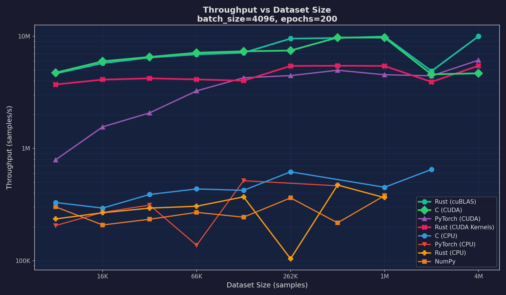
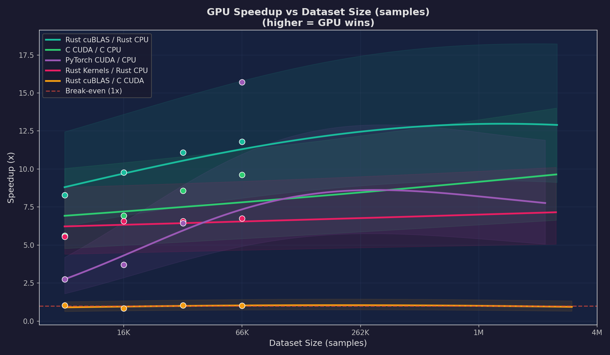
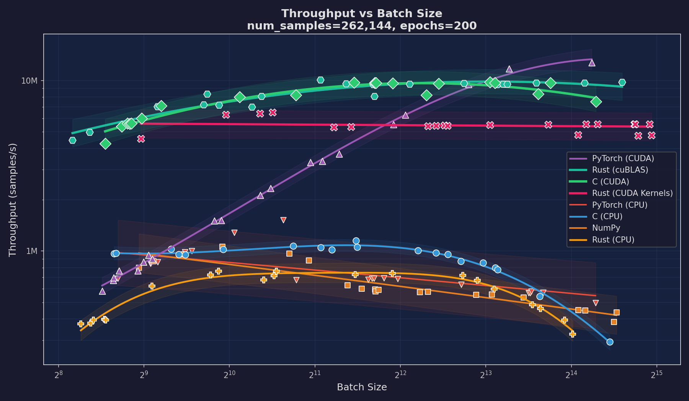
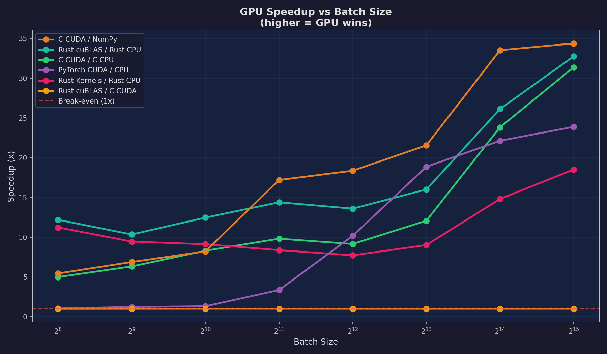
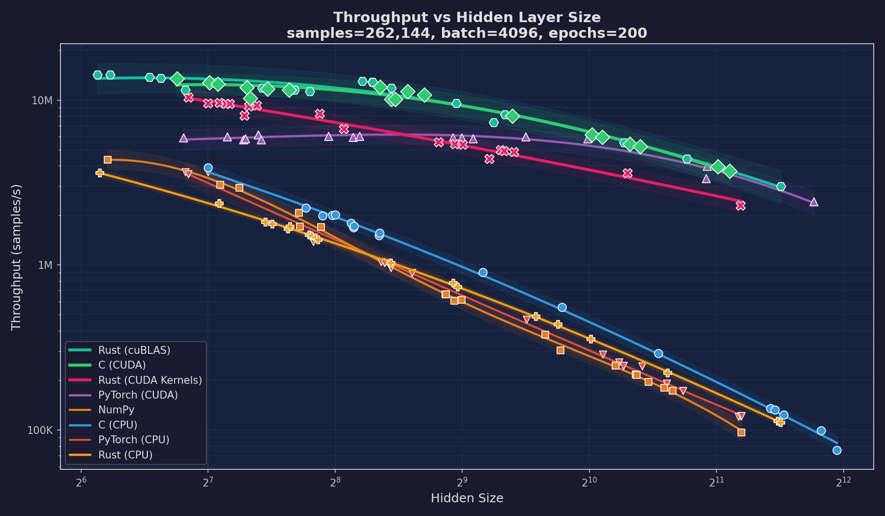
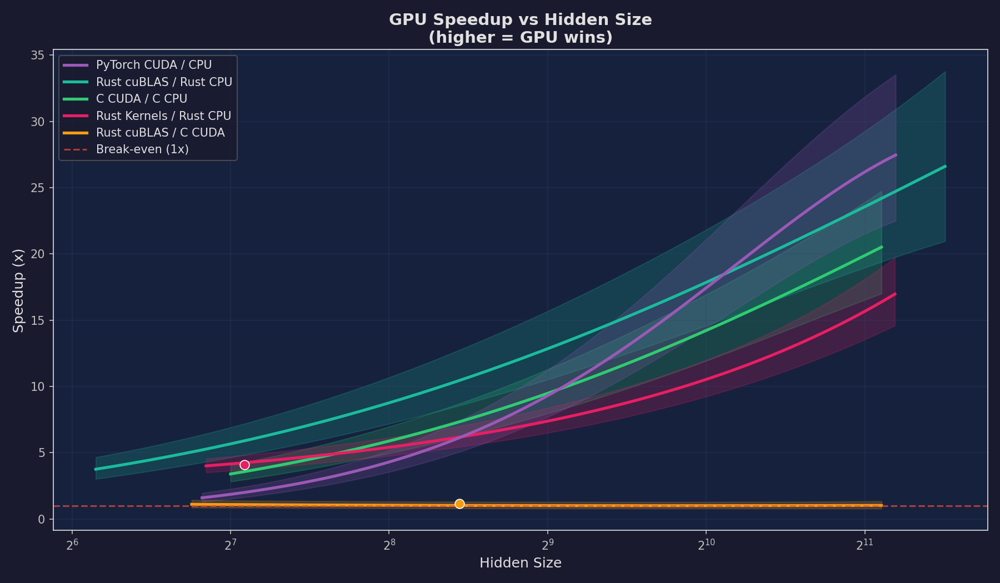
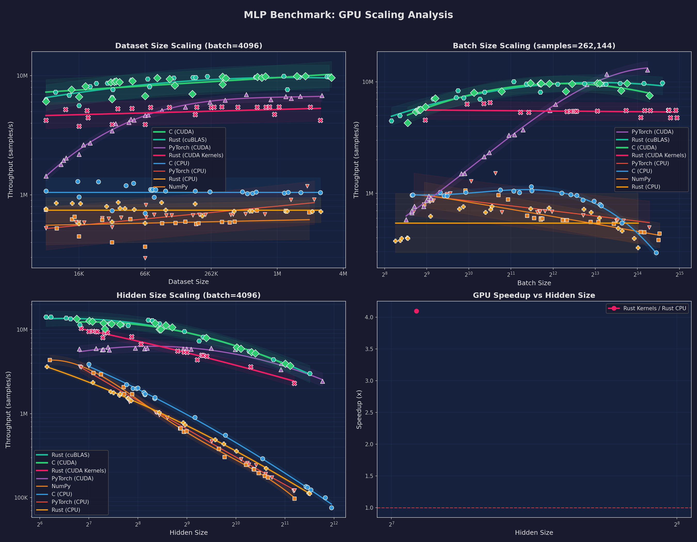

# ML Language Playground: Multi-Language Neural Network Benchmark

A multi-language machine learning benchmark comparing neural network implementations across C, Rust, and Python. Two model families --- MLP and CNN (LeNet-5) --- are each implemented identically in 8 variants spanning CPU and GPU backends to measure throughput scaling.

## MLP Architecture

| Component | Choice | Rationale |
|-----------|--------|-----------|
| Hidden layers | 1 (configurable size, default 64) | Simple enough to implement from scratch, sufficient for tabular data |
| Hidden activation | ReLU | Fast, avoids vanishing gradients |
| Output activation | Softmax | Produces class probabilities for multi-class classification |
| Loss | Cross-entropy | Standard for classification; clean gradient with softmax |
| Initialization | Xavier uniform (sqrt(2/fan_in)) | Keeps activation variance stable across layers |
| Optimizer | Mini-batch SGD (configurable lr/batch) | Simple, no dependencies, easy to implement identically across languages |

## Implementations

| Implementation | File | Description |
|---------------|------|-------------|
| C (CPU) | `src/c/models/mlp/mlp_cpu.c` | Manual backprop in C99 with OpenMP parallelization and cache-tiled GEMM |
| C (CUDA) | `src/c/models/mlp/mlp.cu` | GPU kernels, one CUDA thread per sample, atomicAdd for gradients |
| Rust (CPU) | `src/rust/mlp-cpu/src/main.rs` | Rayon threadpool (physical cores) + cache-tiled GEMM (TILE=64) |
| Rust (cuBLAS) | `src/rust/mlp-cuda-cublas/src/main.rs` | cuBLAS FFI for GEMM + custom CUDA kernels for elementwise ops |
| Rust (CUDA Kernels) | `src/rust/mlp-cuda-kernels/src/main.rs` | All custom CUDA kernels including shared-memory tiled matmul |
| NumPy (CPU) | `src/python/models/mlp/mlp_numpy.py` | Vectorized NumPy, exact replica of C algorithm |
| PyTorch (CPU) | `src/python/models/mlp/mlp_pytorch.py` | nn.Module with manual Xavier init to match C, CPU backend |
| PyTorch (CUDA) | `src/python/models/mlp/mlp_pytorch.py` | Same PyTorch model on GPU via `--device cuda` |

All 8 MLP implementations produce identical standardized output for benchmark parsing, including throughput in samples/s.

## CNN Architecture (LeNet-5)

| Component | Choice | Rationale |
|-----------|--------|-----------|
| Conv1 | 1->6 channels, 5x5 kernel | Classic LeNet-5 first layer for edge/texture detection |
| Conv2 | 6->16 channels, 5x5 kernel | Learns higher-level feature combinations |
| Pooling | 2x2 average pooling (stride 2) | Spatial downsampling, matches original LeNet-5 |
| Convolution method | im2col + GEMM | Converts convolution to matrix multiply, reuses optimized tiled GEMM |
| FC layers | 256->120->84->10 | Standard LeNet-5 classifier (16x4x4 = 256 after two pool layers) |
| Activations | ReLU (all layers) | Modern replacement for LeNet-5's original sigmoid/tanh |
| Output | Softmax + Cross-entropy | Same as MLP for consistent loss computation |
| Initialization | Xavier uniform | Same sqrt(2/fan_in) scale as MLP, adapted for conv fan_in = C_in x kH x kW |
| Optimizer | Mini-batch SGD (lr=0.01) | Identical to MLP for fair comparison |

### CNN Implementations

| Implementation | File | Description |
|---------------|------|-------------|
| C (CPU) | `src/c/models/cnn/cnn_cpu.c` | im2col + OpenMP-parallelized tiled GEMM, shared nn_ops library |
| C (CUDA) | `src/c/models/cnn/cnn.cu` | GPU im2col + cuBLAS GEMM, custom elementwise CUDA kernels |
| Rust (CPU) | `src/rust/cnn-cpu/src/main.rs` | im2col + Rayon threadpool with cache-tiled GEMM (TILE=64) |
| Rust (cuBLAS) | `src/rust/cnn-cuda-cublas/src/main.rs` | cuBLAS GEMM + custom CUDA kernels for conv/pool/activations |
| Rust (CUDA Kernels) | `src/rust/cnn-cuda-kernels/src/main.rs` | All custom CUDA kernels including shared-memory tiled matmul |
| NumPy (CPU) | `src/python/models/cnn/cnn_numpy.py` | Vectorized im2col + NumPy matmul, manual backprop |
| PyTorch (CPU) | `src/python/models/cnn/cnn_pytorch.py` | nn.Module with manual Xavier init, CPU backend |
| PyTorch (CUDA) | `src/python/models/cnn/cnn_pytorch.py` | Same model on GPU via `--device cuda` |

All CNN implementations train on MNIST (60K training / 10K test, 28x28 grayscale digits, 10 classes).

## Datasets

| Name | Samples | Features | Classes | Source |
|------|---------|----------|---------|--------|
| `generated` | Configurable (default 1000) | 2 | 2 | Synthetic 2D circle classification |
| `iris` | 150 | 4 | 3 | UCI Iris |
| `wine-red` | 1599 | 11 | 11 | UCI Wine Quality (red) |
| `wine-white` | 4898 | 11 | 11 | UCI Wine Quality (white) |
| `breast-cancer` | 569 | 30 | 2 | Wisconsin Diagnostic Breast Cancer |
| `mnist` | 70,000 | 784 (28x28) | 10 | Handwritten digits (CNN only) |

## Quick Start

### Prerequisites

- **C**: GCC (C99), CMake 3.10+, OpenMP
- **CUDA**: NVIDIA CUDA Toolkit (for GPU implementations in C and Rust)
- **Rust**: Cargo (2021 edition)
- **Python**: Python 3.8+, NumPy, matplotlib, PyTorch

### Build Everything

The build script detects available toolchains and builds all possible targets:

```bash
./build.sh
```

This downloads datasets, installs Python dependencies, and builds all C, Rust, and CUDA targets. Targets whose toolchains are missing are skipped with a warning.

### Run Individual Implementations

All implementations accept `--batch-size`, `--num-samples`, `--hidden-size`, and `--epochs` flags for configurable hyperparameters.

```bash
# C (CPU)
./src/c/build_cpu/main --dataset iris

# C (CUDA)
./src/c/build_cuda/main --dataset iris

# Rust (CPU)
./src/rust/target/release/mlp-cpu --dataset iris

# Rust (cuBLAS)
./src/rust/target/release/mlp-cuda-cublas --dataset iris

# Rust (CUDA Kernels)
./src/rust/target/release/mlp-cuda-kernels --dataset iris

# NumPy
python3 src/python/models/mlp/mlp_numpy.py --dataset iris

# PyTorch (CPU)
python3 src/python/models/mlp/mlp_pytorch.py --dataset iris --device cpu

# PyTorch (CUDA)
python3 src/python/models/mlp/mlp_pytorch.py --dataset iris --device cuda

# --- CNN (LeNet-5 on MNIST) ---
# C (CPU)
./src/c/build_cpu/cnn_main --dataset mnist

# Rust (CPU)
./src/rust/target/release/cnn-cpu --dataset mnist

# PyTorch (CUDA)
python3 src/python/models/cnn/cnn_pytorch.py --dataset mnist --device cuda
```

### Run Benchmarks

```bash
# MLP: standard mode — accuracy + train time on real datasets
python3 src/scripts/benchmark.py --mode standard --datasets generated,iris,breast-cancer --runs 3

# MLP: scaling mode — throughput vs dataset size, batch size, and hidden size
python3 src/scripts/benchmark.py --mode scaling --runs 1

# CNN: scaling mode — throughput vs batch size on MNIST
python3 src/scripts/benchmark.py --mode scaling --model cnn --runs 1
```

## Scaling Benchmark Analysis

All measurements were collected on an NVIDIA RTX 3070 (46 SMs, 5888 CUDA cores, 8 GB GDDR6) paired with an AMD Ryzen CPU. The benchmark sweeps three independent axes --- dataset size, mini-batch size, and hidden-layer width --- while holding the other two fixed. Each configuration trains the full MLP for 200 epochs and reports end-to-end throughput in samples per second. Implementations that exceeded the 600-second timeout at extreme scales are shown as missing data points. Run `python3 src/scripts/benchmark.py --mode scaling` to regenerate all plots.

### Peak Throughput Summary

| Experiment | Rust (cuBLAS) | C (CUDA) | PyTorch (CUDA) | Rust (Kernels) | C (CPU) | PyTorch (CPU) | NumPy | Rust (CPU) |
|---|---|---|---|---|---|---|---|---|
| Dataset Size | **9.99M** | 9.73M | 6.11M | 5.45M | 650K | 516K | 380K | 472K |
| Batch Size | 10.24M | 10.19M | **13.00M** | 6.28M | 1.04M | 1.24M | 1.04M | 711K |
| Hidden Size | **15.58M** | 15.52M | 6.82M | 11.41M | 6.81M | 4.45M | 4.73M | 4.00M |

---

### Dataset Size Scaling (8K -- 4M samples)

Fixed parameters: batch\_size = 4096, hidden\_size = 512, epochs = 200.



The dataset-size sweep reveals two distinct throughput regimes separated by how well the working set fits in the CPU cache hierarchy. At small dataset sizes (8K--32K samples), the entire training set and all weight matrices reside comfortably in L2/L3 cache. Here, the compiled CPU implementations --- C (CPU) and Rust (CPU) --- achieve reasonable throughput because every memory access hits cache, and the per-sample computation for a 512-wide hidden layer is modest. The GPU implementations, by contrast, show relatively flat throughput from 8K through 64K samples because the kernel launch overhead (roughly 5--20 microseconds per kernel) and host-to-device synchronization represent a fixed cost that dominates when there are only a few mini-batches per epoch.

As dataset size grows beyond 128K samples, the CPU implementations face a sharp decline. The forward and backward passes require streaming through weight gradient matrices that can no longer fit in cache, and each epoch must iterate over proportionally more mini-batches. CPU throughput degrades from the low millions down to hundreds of thousands of samples per second. The GPU implementations, however, remain nearly flat --- Rust cuBLAS and C CUDA both sustain approximately 9--10M samples/s from 64K through 4M samples. This is the memory-bandwidth plateau: the RTX 3070's 448 GB/s memory bandwidth can feed the streaming GEMM workloads with minimal stalling, and the per-kernel launch cost becomes negligible relative to the growing compute workload per batch. PyTorch CUDA settles around 6M samples/s, consistently below the hand-written CUDA paths, a gap attributable to Python dispatch overhead and PyTorch's autograd bookkeeping per backward pass.

At the extreme end (2M--4M samples), CPU implementations begin timing out entirely. C CPU, NumPy, PyTorch CPU, and Rust CPU all exceed the 600-second limit, leaving only the four GPU backends and a few surviving CPU results. This timeout boundary itself is informative: it marks the scale at which GPU acceleration transitions from "nice to have" to "essential."



The GPU speedup plot quantifies this divergence. The speedup ratios are noisy at small dataset sizes due to measurement variance when runtimes are short, but a clear upward trend emerges beyond 64K samples. The C CUDA / NumPy ratio climbs most steeply, reflecting NumPy's interpreted overhead compounding with dataset size. The Rust cuBLAS / C CUDA ratio (orange line) hovers near 1.0x throughout, confirming that the Rust FFI bindings to cuBLAS introduce negligible overhead compared to calling CUDA APIs directly from C.

---

### Batch Size Scaling (256 -- 32K)

Fixed parameters: num\_samples = 262,144, hidden\_size = 512, epochs = 200.



Batch size is the primary lever for GPU utilization because it determines how many threads can execute in parallel during a single GEMM call. The RTX 3070 has 46 streaming multiprocessors, each capable of scheduling up to 2048 threads, for a total of approximately 94K concurrent threads at full occupancy. A batch size of 256 produces GEMM dimensions of (256 x 512) and (512 x 512) --- enough work to partially fill the GPU, but not enough to fully hide memory latency through thread-level parallelism.

The GPU throughput curves rise steeply from batch size 256 through 4096, with each doubling of batch size yielding a near-proportional throughput increase. PyTorch CUDA demonstrates the most dramatic scaling in this regime, climbing from roughly 2M samples/s at batch 256 to 13M samples/s at batch 32K --- making it the overall winner for this experiment. PyTorch's batched tensor operations benefit particularly from large batch sizes because the relative cost of its Python-level dispatch and autograd graph construction decreases as more computation is packed into each kernel launch. Rust cuBLAS and C CUDA track each other closely, both reaching approximately 10.2M samples/s at the largest batch sizes.

The CPU implementations exhibit a different pattern. Throughput initially increases with batch size --- larger batches improve data locality in the tiled GEMM, reduce per-batch loop overhead, and allow OpenMP/Rayon thread pools to amortize scheduling costs. However, beyond batch sizes of 1024--2048, CPU throughput plateaus or declines slightly. The likely cause is increased memory pressure: a (32768 x 512) batch matrix occupies 64 MB in single precision, exceeding L3 cache capacity and forcing the tiled GEMM to spill to main memory on every tile access. The custom CUDA kernel implementation (Rust CUDA Kernels) shows steadier growth than the cuBLAS paths, reaching 6.3M samples/s --- its shared-memory tiled matmul (TILE\_DIM=16) is less optimized than cuBLAS's auto-tuned kernels but still benefits cleanly from increased parallelism.



The batch-size speedup plot illustrates a textbook GPU scaling curve. At batch size 256, GPU speedup over the corresponding CPU implementation ranges from 3--8x. By batch size 32K, the ratios reach 20--35x across most pairs. This monotonic increase demonstrates that GPUs are fundamentally throughput machines: they need large amounts of data-parallel work to justify the fixed costs of kernel launches and memory transfers. The Rust cuBLAS / C CUDA ratio remains flat near 1.0x, once again confirming zero FFI overhead in the hot path.

---

### Hidden Size Scaling (64 -- 4096)

Fixed parameters: num\_samples = 262,144, batch\_size = 4096, epochs = 200.



The hidden-size sweep is the most revealing experiment because it directly controls the arithmetic intensity of the workload. The dominant GEMM operations have dimensions (batch x hidden) and (hidden x hidden), so FLOPs per sample scale as O(hidden^2). This makes hidden-size scaling the clearest test of compute-bound versus memory-bound behavior.

At hidden size 64, the computation per sample is trivial --- a (4096 x 64) matrix multiply requires only 0.5M FLOPs. All implementations cluster between 3M and 15M samples/s, and the CPU implementations are competitive because the tiny weight matrices fit entirely in L1 cache. C CPU achieves 6.8M samples/s, within striking distance of the GPU implementations. This is the memory-bound regime: the GPU's massive compute throughput goes largely unused because the matrices are too small to saturate the arithmetic pipelines.

As hidden size increases to 256 and beyond, the GPU implementations pull away dramatically. Rust cuBLAS and C CUDA maintain remarkably high throughput even at hidden size 2048, where each forward-backward pass involves (4096 x 2048) and (2048 x 2048) matrix multiplications --- workloads that perfectly match cuBLAS's optimized tiling strategies. At hidden size 2048, Rust cuBLAS peaks at 15.6M samples/s and C CUDA at 15.5M samples/s. The custom Rust CUDA kernels achieve 11.4M samples/s --- impressive for hand-written shared-memory kernels, but roughly 27% below cuBLAS, reflecting the gap between a 16x16 fixed tile size and cuBLAS's auto-tuned tile dimensions that adapt to the matrix shape.

The CPU implementations suffer severely at large hidden sizes. With hidden size 4096, the weight matrices alone occupy (4096 x 4096 x 4 bytes) = 64 MB per layer --- far exceeding any CPU cache. Every tile access in the GEMM results in cache misses to main memory, and the O(hidden^2) compute ensures that even OpenMP parallelism cannot compensate. All four CPU implementations (C, Rust, NumPy, PyTorch) time out at hidden size 4096, unable to complete 200 epochs within the 600-second budget.



The hidden-size speedup plot shows the most dramatic GPU advantage of any experiment. At hidden size 64, speedups are modest (2--4x), reflecting the kernel launch overhead on small matrices. By hidden size 2048, the C CUDA / NumPy speedup reaches approximately 55x, and the C CUDA / C CPU ratio exceeds 33x. The curve is super-linear in hidden size because the GPU's throughput degrades more slowly than the CPU's --- the GPU has enough on-chip SRAM (shared memory plus register file) to tile large matrix multiplies efficiently, while the CPU's cache hierarchy is overwhelmed. The Rust cuBLAS / Rust CPU and Rust Kernels / Rust CPU curves demonstrate that the GPU advantage is not language-dependent but architecture-dependent: the same Rust codebase shows a 21--33x speedup simply by switching the GEMM backend from CPU tiling to GPU execution.

At hidden size 4096, CPU implementations timed out, so speedup ratios could not be computed for that data point --- but the trend is unambiguous. For compute-bound MLP training at realistic hidden layer widths, GPU acceleration delivers one to two orders of magnitude improvement.

---

### Overview



## Project Structure

```
ML-in-C/
├── data/                          # Datasets (downloaded via scripts)
├── figs/                          # Generated benchmark charts
├── src/
│   ├── c/
│   │   ├── CMakeLists.txt         # Top-level CMake config
│   │   ├── data_loader.c/.h       # Dataset loaders (C)
│   │   ├── main.c                 # MLP CLI entry point
│   │   ├── cnn_main.c             # CNN CLI entry point
│   │   ├── nn_ops/                # Shared neural network operations
│   │   │   ├── nn_ops.h           # GEMM, activations, loss, softmax interface
│   │   │   ├── nn_ops_cpu.c       # CPU implementations (OpenMP)
│   │   │   └── nn_ops.cu          # CUDA implementations
│   │   ├── models/mlp/            # MLP model (mlp.h, mlp_cpu.c, mlp.cu)
│   │   └── models/cnn/            # CNN model (cnn.h, cnn_cpu.c, cnn.cu)
│   ├── rust/
│   │   ├── Cargo.toml             # Workspace root
│   │   ├── nn-common/             # Shared data loading, CLI, normalization
│   │   ├── mlp-cpu/               # MLP CPU: Rayon + tiled GEMM
│   │   ├── mlp-cuda-cublas/       # MLP GPU: cuBLAS FFI + custom CUDA kernels
│   │   ├── mlp-cuda-kernels/      # MLP GPU: all custom CUDA kernels
│   │   ├── cnn-cpu/               # CNN CPU: im2col + Rayon tiled GEMM
│   │   ├── cnn-cuda-cublas/       # CNN GPU: cuBLAS GEMM + CUDA kernels
│   │   └── cnn-cuda-kernels/      # CNN GPU: all custom CUDA kernels
│   ├── python/
│   │   ├── models/mlp/
│   │   │   ├── data_utils.py      # Shared data loading (mirrors C data_loader)
│   │   │   ├── mlp_numpy.py       # NumPy MLP implementation
│   │   │   └── mlp_pytorch.py     # PyTorch MLP (CPU + CUDA)
│   │   ├── models/cnn/
│   │   │   ├── cnn_numpy.py       # NumPy CNN with im2col
│   │   │   └── cnn_pytorch.py     # PyTorch CNN (CPU + CUDA)
│   │   └── setup.py
│   └── scripts/
│       ├── benchmark.py           # Benchmark runner (MLP + CNN, standard + scaling)
│       ├── tune_benchmark.py      # OMP threshold tuning script
│       ├── download_datasets.sh   # Download UCI + MNIST datasets
│       ├── preprocess_iris.py     # Preprocess Iris data
│       └── run_pipeline.sh        # Full pipeline (download + build + run)
├── build.sh                       # One-command build (detects toolchains)
├── mathematical_foundations.md    # Math derivations for the MLP algorithm
├── requirements.txt               # Python dependencies
├── LICENSE                        # Apache 2.0
└── README.md
```

## Mathematical Foundations

See [mathematical_foundations.md](mathematical_foundations.md) for detailed derivations of:
- Feature normalization (z-score)
- Xavier weight initialization
- Forward propagation (ReLU + numerically stable softmax)
- Cross-entropy loss
- Backpropagation (including the softmax+CE gradient shortcut)
- Mini-batch SGD with gradient averaging

## License

This project is licensed under the Apache License (Version 2.0) — see the [LICENSE](LICENSE) file for details.
