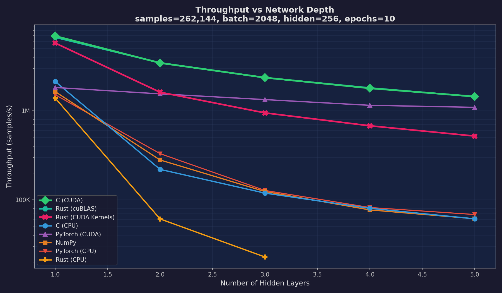
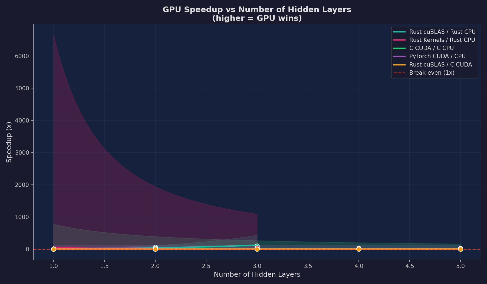

# ML Language Playground: Multi-Language Neural Network Benchmark

A multi-language machine learning benchmark comparing neural network implementations across C, Rust, and Python. Two model families --- MLP (8 implementations) and CNN/LeNet-5 (10 implementations) --- span CPU and GPU backends to measure throughput scaling.

## MLP Architecture

| Component | Choice | Rationale |
|-----------|--------|-----------|
| Hidden layers | 1–5 (configurable depth and width) | `--num-hidden-layers N` controls depth; all hidden layers share `--hidden-size` width |
| Hidden activation | ReLU | Fast, avoids vanishing gradients |
| Output activation | Softmax | Produces class probabilities for multi-class classification |
| Loss | Cross-entropy | Standard for classification; clean gradient with softmax |
| Initialization | Xavier uniform (sqrt(2/fan_in)) | Keeps activation variance stable across layers |
| Optimizer | Mini-batch SGD or Adam (configurable) | SGD: simple baseline; Adam: adaptive per-parameter learning rates |
| Scheduler | None or cosine annealing with warmup | Optional cosine decay (5% linear warmup, decay to lr_min=1e-6) |

## Implementations

| Implementation | File | Description |
|---------------|------|-------------|
| C (CPU) | `src/c/models/mlp/mlp_cpu.c` | Manual backprop in C99 with OpenMP parallelization and cache-tiled GEMM |
| C (CUDA) | `src/c/models/mlp/mlp.cu` | GPU kernels with cuBLAS GEMM and custom elementwise CUDA kernels |
| Rust (CPU) | `src/rust/models/mlp-cpu/src/main.rs` | Rayon threadpool (physical cores) + cache-tiled GEMM (TILE=64) |
| Rust (cuBLAS) | `src/rust/models/mlp-cuda-cublas/src/main.rs` | cuBLAS FFI for GEMM + custom CUDA kernels for elementwise ops |
| Rust (CUDA Kernels) | `src/rust/models/mlp-cuda-kernels/src/main.rs` | All custom CUDA kernels including shared-memory tiled matmul |
| NumPy (CPU) | `src/python/models/mlp/mlp_numpy.py` | Vectorized NumPy, exact replica of C algorithm |
| PyTorch (CPU) | `src/python/models/mlp/mlp_pytorch.py` | nn.Module with manual Xavier init to match C, CPU backend |
| PyTorch (CUDA) | `src/python/models/mlp/mlp_pytorch.py` | Same PyTorch model on GPU via `--device cuda` |

All 8 MLP implementations produce identical standardized output for benchmark parsing, including throughput in samples/s.

## CNN Architecture (LeNet-5)

| Component | Choice | Rationale |
|-----------|--------|-----------|
| Conv1 | 1->6 channels, 5x5 kernel | Classic LeNet-5 first layer for edge/texture detection |
| Conv2 | 6->16 channels, 5x5 kernel | Learns higher-level feature combinations |
| Pooling | 2x2 average pooling (stride 2) | Spatial downsampling, matches original LeNet-5 |
| Convolution method | im2col + GEMM | Converts convolution to matrix multiply, reuses optimized tiled GEMM |
| FC layers | 256->120->84->10 | Standard LeNet-5 classifier (16x4x4 = 256 after two pool layers) |
| Activations | ReLU (all layers) | Modern replacement for LeNet-5's original sigmoid/tanh |
| Output | Softmax + Cross-entropy | Same as MLP for consistent loss computation |
| Initialization | Xavier uniform | Same sqrt(2/fan_in) scale as MLP, adapted for conv fan_in = C_in x kH x kW |
| Optimizer | Mini-batch SGD or Adam | Same optimizer support as MLP |
| Scheduler | None or cosine annealing | Same scheduler support as MLP |

### CNN Implementations

| Implementation | File | Description |
|---------------|------|-------------|
| C (CPU) | `src/c/models/cnn/cnn_cpu.c` | im2col + OpenMP-parallelized tiled GEMM, shared nn_ops library |
| C (CUDA) | `src/c/models/cnn/cnn.cu` | GPU im2col + cuBLAS GEMM, custom elementwise CUDA kernels |
| C (cuDNN) | `src/c/models/cnn/cnn.cu` | cuDNN convolution backend via `--backend cudnn` |
| Rust (CPU) | `src/rust/models/cnn-cpu/src/main.rs` | im2col + Rayon threadpool with cache-tiled GEMM (TILE=64) |
| Rust (cuBLAS) | `src/rust/models/cnn-cuda-cublas/src/main.rs` | cuBLAS GEMM + custom CUDA kernels for conv/pool/activations |
| Rust (CUDA Kernels) | `src/rust/models/cnn-cuda-kernels/src/main.rs` | All custom CUDA kernels including shared-memory tiled matmul |
| Rust cuBLAS (cuDNN) | `src/rust/models/cnn-cuda-cublas/src/main.rs` | cuDNN convolution backend via `--backend cudnn` |
| Rust Kernels (cuDNN) | `src/rust/models/cnn-cuda-kernels/src/main.rs` | cuDNN convolution backend via `--backend cudnn` |
| PyTorch (CPU) | `src/python/models/cnn/cnn_pytorch.py` | nn.Module with manual Xavier init, CPU backend |
| PyTorch (CUDA) | `src/python/models/cnn/cnn_pytorch.py` | Same model on GPU via `--device cuda` |

NumPy is excluded from CNN benchmarks: pure-Python im2col is prohibitively slow (timeouts at 600s), unlike MLP where NumPy's BLAS backend makes it a competitive CPU baseline.

All CNN implementations train on MNIST (60K training / 10K test, 28x28 grayscale digits, 10 classes).

## Datasets

| Name | Samples | Features | Classes | Source |
|------|---------|----------|---------|--------|
| `generated` | Configurable (default 1000) | 2 | 2 | Synthetic 2D circle classification |
| `iris` | 150 | 4 | 3 | UCI Iris |
| `wine-red` | 1599 | 11 | 11 | UCI Wine Quality (red) |
| `wine-white` | 4898 | 11 | 11 | UCI Wine Quality (white) |
| `breast-cancer` | 569 | 30 | 2 | Wisconsin Diagnostic Breast Cancer |
| `mnist` | 70,000 | 784 (28x28) | 10 | Handwritten digits (CNN only) |

## Quick Start

### Prerequisites

- **C**: GCC (C99), CMake 3.10+, OpenMP
- **CUDA**: NVIDIA CUDA Toolkit (for GPU implementations in C and Rust)
- **Rust**: Cargo (2021 edition)
- **Python**: Python 3.8+, NumPy, matplotlib, PyTorch

### Full Pipeline (Recommended)

The `run.sh` wrapper handles build, tuning, benchmarking, scaling experiments, and plot generation with log rotation:

```bash
# Full pipeline for all models
./run.sh

# Single model only
./run.sh --model mlp
./run.sh --model cnn

# Skip tuning (use cached tuned params)
./run.sh --skip-tune
```

### Build Everything

```bash
./build.sh
```

This downloads datasets, installs Python dependencies, and builds all C, Rust, and CUDA targets. Targets whose toolchains are missing are skipped with a warning.

### Pipeline Phases

```bash
# Full pipeline for all models (build -> tune -> benchmark -> plot)
python3 src/scripts/pipeline.py all

# Single model only
python3 src/scripts/pipeline.py all --model mlp
python3 src/scripts/pipeline.py all --model cnn

# Individual phases
python3 src/scripts/pipeline.py tune --model mlp      # Two-phase successive halving
python3 src/scripts/pipeline.py benchmark --model cnn  # Run benchmarks with tuned params
python3 src/scripts/pipeline.py plot --model mlp       # Regenerate plots from cache
```

Tuning uses two-phase successive halving: throughput sweep for batch size, then LR halving per optimizer track (SGD + Adam). Results are cached to `results/cache/tuning_{model}.yaml` and automatically loaded by the benchmark phase.

### Run Individual Implementations

All implementations accept `--batch-size`, `--num-samples`, `--hidden-size`, `--num-hidden-layers`, `--epochs`, `--optimizer sgd|adam`, and `--scheduler none|cosine` flags.

```bash
# C (CPU)
./src/c/build_cpu/main --dataset iris

# C (CUDA)
./src/c/build_cuda/main --dataset iris

# Rust (CPU)
./src/rust/target/release/mlp-cpu --dataset iris

# Rust (cuBLAS)
./src/rust/target/release/mlp-cuda-cublas --dataset iris

# Rust (CUDA Kernels)
./src/rust/target/release/mlp-cuda-kernels --dataset iris

# NumPy
python3 src/python/models/mlp/mlp_numpy.py --dataset iris

# PyTorch (CPU)
python3 src/python/models/mlp/mlp_pytorch.py --dataset iris --device cpu

# PyTorch (CUDA)
python3 src/python/models/mlp/mlp_pytorch.py --dataset iris --device cuda

# Multi-layer MLP example (3 hidden layers, 256 neurons each)
./src/rust/target/release/mlp-cpu --dataset generated --num-hidden-layers 3 --hidden-size 256

# --- CNN (LeNet-5 on MNIST) ---
# C (CPU)
./src/c/build_cpu/cnn_main --dataset mnist

# Rust (CPU)
./src/rust/target/release/cnn-cpu --dataset mnist

# PyTorch (CUDA)
python3 src/python/models/cnn/cnn_pytorch.py --dataset mnist --device cuda
```

### Run Benchmarks

```bash
# MLP: standard mode — accuracy + train time on real datasets
python3 src/scripts/benchmark.py --mode standard --datasets generated,iris,breast-cancer --runs 3

# MLP: scaling mode — throughput vs dataset size, batch size, hidden size, and network depth
python3 src/scripts/benchmark.py --mode scaling --runs 1

# MLP: budget mode — accumulate benchmark samples with variance-weighted scheduling
# Runs can be repeated; results accumulate in results/cache/benchmark_cache.json
python3 src/scripts/benchmark.py --mode scaling --budget 60   # 60 minutes

# Replot from cached data without running any benchmarks
python3 src/scripts/benchmark.py --mode scaling --budget 0

# CNN: scaling mode — throughput vs batch size on MNIST
python3 src/scripts/benchmark.py --mode scaling --model cnn --runs 1

# CNN: budget mode — accumulate samples (results merge with cache)
python3 src/scripts/benchmark.py --mode scaling --model cnn --budget 30 --scaling-epochs 20

# Replot CNN from cache
python3 src/scripts/benchmark.py --mode scaling --model cnn --budget 0
```

## MLP Scaling Benchmark Analysis

All measurements were collected on an NVIDIA RTX 3070 (46 SMs, 5888 CUDA cores, 8 GB GDDR6) paired with an Intel Core i9-10900F (10 cores, 20 threads, 2.80 GHz). The benchmark sweeps four independent axes --- dataset size, mini-batch size, hidden-layer width, and network depth --- while holding the others fixed. Each configuration trains the full MLP for 10 epochs and reports end-to-end throughput in samples per second.

Throughput curves are fitted using Gaussian Process regression in log-log space, with 95% confidence bands derived from the GP posterior. Data points are sampled from continuous log-uniform distributions (not a fixed grid) using a gap-filling strategy that ensures even coverage. Results accumulate across runs via `--budget`, and the variance-weighted scheduler prioritizes under-sampled regions. Run `python3 src/scripts/benchmark.py --mode scaling --budget 60` to extend the dataset, or `--budget 0` to replot from cache.

### Peak Throughput Summary

| Experiment | C (CUDA) | Rust (cuBLAS) | Rust (Kernels) | PyTorch (CUDA) | C (CPU) | PyTorch (CPU) | NumPy | Rust (CPU) |
|---|---|---|---|---|---|---|---|---|
| Dataset Size | **8.92M** | 8.21M | 5.25M | 3.35M | 1.29M | 1.34M | 769K | 852K |
| Batch Size | 7.21M | **7.21M** | 4.80M | 2.76M | 851K | 883K | 829K | 675K |
| Hidden Size | **9.70M** | 9.15M | 8.75M | 1.80M | 5.96M | 1.58M | 3.89M | 3.21M |
| Network Depth | **6.92M** | 6.69M | 5.76M | 1.83M | 2.13M | 1.51M | 1.64M | 1.39M |

---

### Dataset Size Scaling (8K -- 4M samples)

Fixed parameters: batch\_size = 2048, hidden\_size = 256, epochs = 10.


The dataset-size sweep shows that GPU throughput rises with dataset size and plateaus once there are enough mini-batches to amortize kernel launch overhead. C CUDA and Rust cuBLAS lead at ~9M samples/s at large dataset sizes, with Rust CUDA Kernels at ~5M and PyTorch CUDA around ~3.3M. The CPU implementations cluster between 700K and 1.3M samples/s, with C (CPU) and PyTorch (CPU) at the top of the CPU tier.

This scaling behavior is expected: with a fixed batch size of 2048, each mini-batch GEMM has the same dimensions regardless of total samples. More data simply means more mini-batches per epoch, and throughput (samples per second) stays constant once the GPU pipeline is saturated.


The GPU speedup plot shows a roughly constant 5--10x ratio across dataset sizes, confirming that the GPU advantage comes from faster per-batch computation, not from better amortization. The Rust cuBLAS / C CUDA ratio (orange) hovers near 1.0x throughout, confirming zero overhead from Rust's FFI bindings.

---

### Batch Size Scaling (256 -- 16K)

Fixed parameters: num\_samples = 262,144, hidden\_size = 256, epochs = 10.


Batch size is the primary lever for GPU utilization because it determines how many threads can execute in parallel during a single GEMM call. The RTX 3070 has 46 streaming multiprocessors, each capable of scheduling up to 2048 threads, for a total of approximately 94K concurrent threads at full occupancy.

The GPU throughput curves rise steeply from batch size 256 through 16K, with C CUDA and Rust cuBLAS neck-and-neck at ~7.2M samples/s at the largest batch sizes. The custom CUDA kernel implementation (Rust CUDA Kernels) reaches ~4.8M samples/s --- its shared-memory tiled matmul (TILE\_DIM=16) is less optimized than cuBLAS's auto-tuned kernels but still benefits cleanly from increased parallelism. PyTorch CUDA reaches ~2.8M, with its Python dispatch and autograd overhead consuming a larger share at these matrix dimensions.

The CPU implementations show flatter scaling. Beyond batch sizes of 1024--2048, throughput plateaus as the per-batch matrices begin to exceed L3 cache capacity, causing the tiled GEMM to spill to main memory.


The batch-size speedup plot illustrates a textbook GPU scaling curve. At batch size 256, GPU speedup ranges from 2--5x. By the largest batch sizes, the ratios reach 10--15x. This monotonic increase demonstrates that GPUs need large amounts of data-parallel work to justify kernel launch and memory transfer overhead.

---

### Hidden Size Scaling (64 -- 8K)

Fixed parameters: num\_samples = 262,144, batch\_size = 2048, epochs = 10.


The hidden-size sweep is the most revealing experiment because it directly controls the arithmetic intensity of the workload. The dominant GEMM operations have dimensions (batch x hidden) and (hidden x hidden), so FLOPs per sample scale as O(hidden^2). This makes hidden-size scaling the clearest test of compute-bound versus memory-bound behavior.

At small hidden sizes (~64), all implementations cluster between 1M and 10M samples/s. The CPU implementations are competitive because the tiny weight matrices fit entirely in L1/L2 cache --- this is the memory-bound regime where the GPU's massive compute throughput goes largely unused.

As hidden size increases to 256 and beyond, the GPU implementations pull away. C CUDA peaks at 9.7M samples/s and Rust cuBLAS at 9.2M, while the custom Rust CUDA kernels reach 8.75M --- impressive for hand-written shared-memory kernels. The CPU implementations suffer severely at large hidden sizes: large weight matrices exceed cache capacity, and the O(hidden^2) compute ensures that even OpenMP parallelism cannot compensate. All CPU implementations converge to similar low throughput at the largest hidden sizes.


The hidden-size speedup plot shows the most dramatic GPU advantage of any experiment. At small hidden sizes, speedups are modest (1--2x). As hidden size grows, the speedup curves rise because the GPU's throughput degrades more slowly than the CPU's --- the GPU has enough on-chip SRAM (shared memory plus register file) to tile large matrix multiplies efficiently, while the CPU's cache hierarchy is overwhelmed.

---

### Network Depth Scaling (1 -- 5 hidden layers)

Fixed parameters: num\_samples = 262,144, batch\_size = 2048, hidden\_size = 256, epochs = 10.



The depth sweep is a new scaling axis that tests how implementations handle the sequential overhead of deeper networks. Adding hidden layers increases the total compute linearly (each layer adds a (batch x hidden) x (hidden x hidden) GEMM in forward and two GEMMs in backward), but also adds sequential dependencies: layer N's activations depend on layer N-1, preventing pipelining across layers.

The GPU implementations degrade gracefully with depth. C CUDA drops from ~7M samples/s at 1 layer to ~2.5M at 5 layers, and Rust cuBLAS tracks it closely. This roughly 3x degradation across 5x more layers reflects the inherent parallelism within each GEMM: even though layers are sequential, each individual matrix multiply fully saturates the GPU's SMs. Rust CUDA Kernels shows the same graceful degradation, landing at ~1.5M at 5 layers.

The CPU implementations show steeper degradation. C (CPU) drops from ~2M to ~200K, and Rust (CPU) from ~1.4M to ~100K at 5 layers. The deeper network's working set (5 layers x 256x256 weights + activations) far exceeds L3 cache, so each layer's GEMM pays full main-memory latency. NumPy (using OpenBLAS) holds up better than the hand-tuned CPU implementations at depth --- its optimized BLAS kernels handle the increased memory pressure more efficiently.

The depth experiment reveals a key architectural insight: GPU advantage grows with network depth because each additional layer adds fixed overhead on the CPU (cache thrashing, thread scheduling) while the GPU absorbs it with minimal penalty (kernel launches are ~5us each, negligible compared to the GEMM compute time).



---

### Overview


---

## CNN Scaling Benchmark Analysis

The CNN benchmark uses the same GP regression methodology as MLP, sweeping batch size from 16 to 1024 on the MNIST dataset (60,000 training images, fixed LeNet-5 architecture). Because MNIST is a fixed-size dataset and LeNet-5 has no configurable hidden size or depth, batch size is the only meaningful scaling axis. The CNN benchmarks include cuDNN backend variants (via `--backend cudnn`) alongside the hand-written im2col implementations.

### CNN Peak Throughput

| Implementation | Peak Throughput | Notes |
|---|---|---|
| Rust cuBLAS (cuDNN) | **262K/s** | cuDNN fused convolution kernels via Rust FFI |
| C (cuDNN) | 260K/s | cuDNN convolution backend |
| Rust Kernels (cuDNN) | 249K/s | cuDNN convolution + custom CUDA FC layers |
| PyTorch (CUDA) | 187K/s | Built-in cuDNN via autograd |
| Rust (cuBLAS) | 152K/s | im2col + cuBLAS GEMM |
| Rust (CUDA Kernels) | 150K/s | im2col + shared-memory tiled matmul |
| C (CUDA) | 150K/s | im2col + cuBLAS GEMM |
| PyTorch (CPU) | 31K/s | CPU convolution via autograd |
| C (CPU) | 15K/s | im2col + OpenMP tiled GEMM |
| Rust (CPU) | 6K/s | im2col + Rayon tiled GEMM |

### Batch Size Scaling (16 -- 1024)

Fixed parameters: MNIST (60K samples), LeNet-5 architecture, epochs = 5.


The CNN batch-size sweep tells a different story than MLP because the computational profile is fundamentally different. Where MLP throughput is dominated by large GEMM operations on the fully connected layers, CNN throughput is bottlenecked by the im2col transform and the relatively small GEMMs it produces. Conv1 produces a (6x25) x (25x576) multiply and Conv2 a (16x150) x (150x64) multiply --- both far smaller than the MLP's (batch x hidden) x (hidden x hidden) GEMMs.

The cuDNN implementations dominate the CNN benchmark at ~250--260K samples/s, with the hand-written Rust FFI bindings to cuDNN matching C's cuDNN performance exactly. cuDNN uses specialized convolution algorithms (Winograd, FFT-based) that bypass im2col entirely for common kernel sizes. The custom im2col implementations (C CUDA, Rust cuBLAS, Rust Kernels) cluster at ~150K/s --- competitive but roughly 40% below cuDNN, reflecting the memory traffic cost of materializing the column matrix.

PyTorch CUDA reaches ~187K/s, benefiting from its built-in cuDNN integration but paying Python dispatch and autograd overhead that places it between the cuDNN and custom im2col tiers.

The CPU implementations show wide spread. PyTorch CPU (31K/s) benefits from its optimized CPU convolution path. C (CPU) at 15K/s uses OpenMP parallelism across the per-sample im2col + GEMM loop. Rust (CPU) at 6K/s is the slowest, with Rayon's threadpool incurring more scheduling overhead on the fine-grained per-sample work.


The GPU speedup plot shows Rust cuBLAS / Rust CPU and Rust Kernels / Rust CPU achieving 20--30x speedups at larger batch sizes. C CUDA / C CPU reaches ~10x. The speedup grows with batch size as the GPU SMs are more fully utilized with larger batch GEMMs.


## Project Structure

```
ML-in-C/
├── data/                          # Datasets (downloaded via scripts)
├── configs/                       # Layered YAML config (base + model overrides)
├── results/
│   ├── plots/mlp/                 # MLP benchmark charts
│   ├── plots/cnn/                 # CNN benchmark charts
│   ├── cache/                     # Benchmark cache (gitignored)
│   └── logs/                      # Benchmark logs (gitignored)
├── src/
│   ├── c/
│   │   ├── CMakeLists.txt         # Top-level CMake config
│   │   ├── data_loader.c/.h       # Dataset loaders (C)
│   │   ├── main.c                 # MLP CLI entry point
│   │   ├── cnn_main.c             # CNN CLI entry point
│   │   ├── nn_ops/                # Shared neural network operations
│   │   │   ├── nn_ops.h           # GEMM, activations, loss, softmax interface
│   │   │   ├── nn_ops_cpu.c       # CPU implementations (OpenMP)
│   │   │   └── nn_ops.cu          # CUDA implementations
│   │   ├── models/mlp/            # MLP model (mlp.h, mlp_cpu.c, mlp.cu)
│   │   └── models/cnn/            # CNN model (cnn.h, cnn_cpu.c, cnn.cu)
│   ├── rust/
│   │   ├── Cargo.toml             # Workspace root
│   │   ├── utils/nn-common/       # Shared data loading, CLI, normalization
│   │   ├── models/mlp-cpu/        # MLP CPU: Rayon + tiled GEMM
│   │   ├── models/mlp-cuda-cublas/  # MLP GPU: cuBLAS FFI + custom CUDA kernels
│   │   ├── models/mlp-cuda-kernels/ # MLP GPU: all custom CUDA kernels
│   │   ├── models/cnn-cpu/        # CNN CPU: im2col + Rayon tiled GEMM
│   │   ├── models/cnn-cuda-cublas/  # CNN GPU: cuBLAS GEMM + CUDA kernels
│   │   └── models/cnn-cuda-kernels/ # CNN GPU: all custom CUDA kernels
│   ├── python/
│   │   ├── models/mlp/
│   │   │   ├── mlp_numpy.py       # NumPy MLP implementation
│   │   │   └── mlp_pytorch.py     # PyTorch MLP (CPU + CUDA)
│   │   ├── models/cnn/
│   │   │   └── cnn_pytorch.py     # PyTorch CNN (CPU + CUDA)
│   │   └── utils/data_utils.py    # Shared data loading (mirrors C data_loader)
│   └── scripts/
│       ├── pipeline.py            # Unified pipeline: build -> tune -> benchmark -> plot
│       ├── config.py              # Layered YAML config loader (base + model overrides)
│       ├── tuning.py              # Two-phase successive halving hyperparameter tuning
│       ├── benchmark.py           # Benchmark runner (MLP + CNN, standard + scaling)
│       ├── plotting.py            # Plot generation from cached benchmark data
│       ├── download_datasets.sh   # Download UCI + MNIST datasets
│       └── preprocess_iris.py     # Preprocess Iris data
├── run.sh                         # One-command pipeline with log rotation
├── build.sh                       # One-command build (detects toolchains)
├── mathematical_foundations.md    # Math derivations for MLP and CNN algorithms
├── requirements.txt               # Python dependencies
├── LICENSE                        # Apache 2.0
└── README.md
```

## Mathematical Foundations

See [mathematical_foundations.md](mathematical_foundations.md) for detailed derivations covering both the MLP and CNN:
- Feature normalization (z-score) and Xavier weight initialization
- Forward/backward propagation with ReLU, numerically stable softmax, and cross-entropy loss
- The softmax + cross-entropy gradient shortcut
- Convolution via im2col: transforming sliding-window operations into GEMM
- Average pooling forward and backward passes
- col2im gradient scattering with overlap accumulation
- Mini-batch SGD with gradient averaging

## License

This project is licensed under the Apache License (Version 2.0) — see the [LICENSE](LICENSE) file for details.
